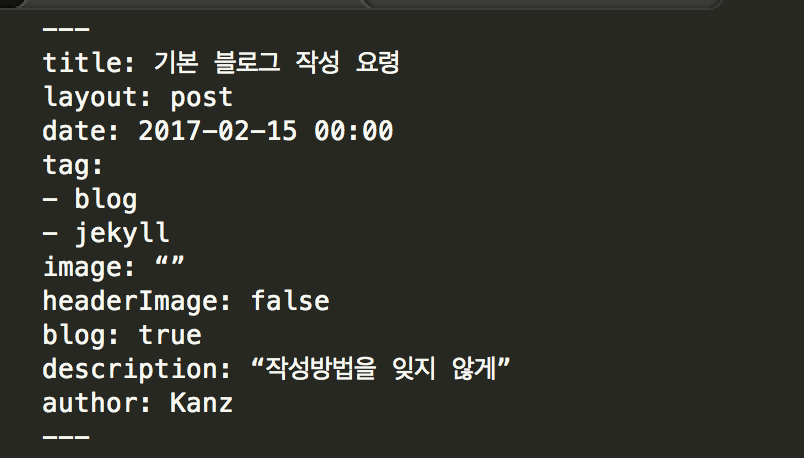
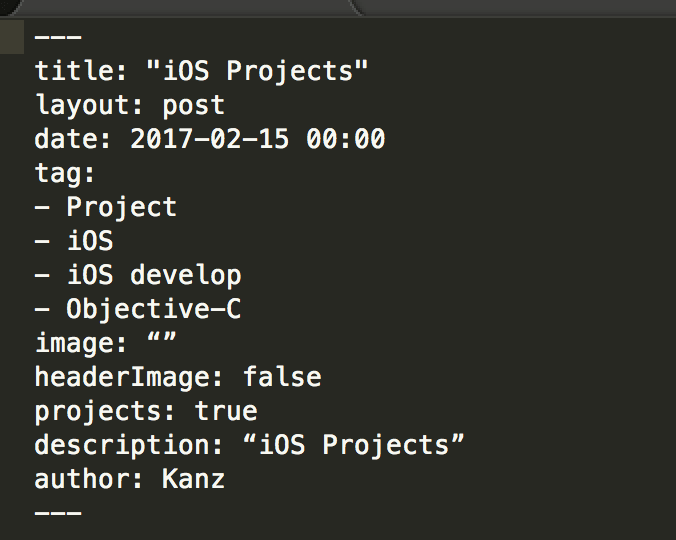

github pages 와 indigo theme를 사용하고 있으며,  
theme 내에 gulp 가 적용되어 있음.  

터미널에서 Blog 루트 폴더로 이동하여
gulp 를 동작시키면 localhost:3000 으로 연결되어 변경사항을 바로바로 확인할 수 있음.  

파일명은 YYYY-MM-DD-"post-name".md 의 룰을 지켜주어야하며, 한글은 안됨.

기본 포스팅 layout format 에 맞지 않는 경우 터미널에 에러 라인이 표시 됨.
기본 레이아웃은 다음과 같다.

블로그 포스팅 템플릿

프로젝트 포스팅 템플릿
 