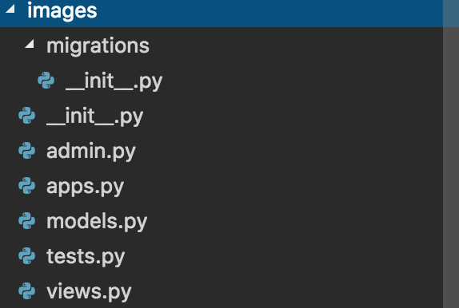

# Apps
쿠키 커터에 의해 User App은 기본으로 생성되어 있는 상태이며, 필요한 App을 생성하여야 한다.
터미널에서 <code>django-admin startapp [생성할 앱이름]</code> 을 입력하면 다음과 같은 구조로 앱이 생성된다.   

## 생성한 앱 설정
* 앞서 config - settings 폴더의 base.py 파일에는 여러가지 설정들이 되어 있는 것을 확인하였다.
그중 # APPS 라는 항목을 보면 DJANGO_APPS, THIRD_PARTY_APPS, LOCAL_APPS 항목을 볼수 있다.
LOCAL_APPS가 바로 생성한 앱에 관한 내용을 설정해줄 수 있는 곳이다.
* 생성한 App 폴더 내 apps.py 의 name값을 지정한다. 기본상태는 최초 생성한 이름일 것이다.
* 이 name 값을 LOCAL_APPS 내에 지정한다. [지정이름.apps.클래스명]
* 주의할 점은 프로젝트 폴더에 생성한 장고프로젝트 내에 앱을 생성해야 위의 방식이 적용된다는 점이다.
* 기본으로 설정되어 있는 Users 폴더와 같은 위치에 생성하는 것으로 기억해두자.
* 생성한 Apps 안에 url.py 라는 파일을 생성해두고 다음에 사용하도록 하자.
